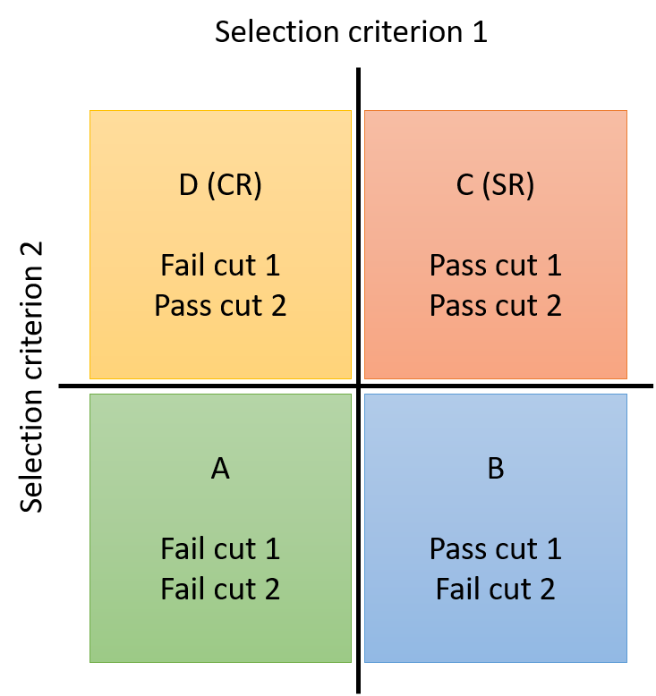
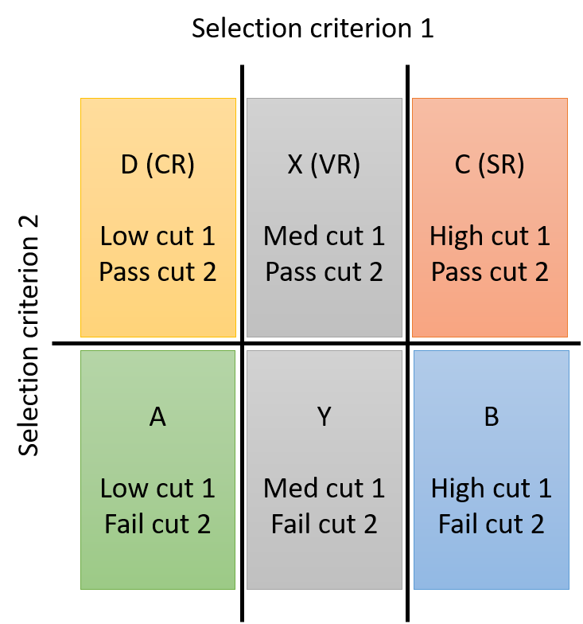

# Background Modelling Techniques

!!! Warning
    This page is under construction

Accurate modeling of SM background processes is essential to most searches and measurements in high energy physics.
The dominant background processes depend strongly on the selected objects, particularly leptons, missing
transverse momentum, and b quark jets or jets from boosted particles. Background estimation strategies
are always tailored to an individual analysis, typically as a variation of one or more of the following
common methods. 

## Simulation

Many SM processes are simulated at NLO, which provides a strong basis for background
estimation. For processes such as W/Z+jets production that are often simulated at LO, *k*-factor
calculations allows one to weight simulated events to reproduce predictions of distributions at NLO.
In final states with charged leptons, for which QCD multijet production is unlikely to be a significant background, simulation is a common choice.
Additionally, the majority of searches utilize simulation to model the signal process under consideration.

Simulated events are weighted so that the efficiencies of certain selections
in simulation match those observed in data. These corrections are referred to as ``scale factors''. 
Common scale factors in searches at the CMS experiment correct
for differences in :

- the number of pileup interactions
- the efficiencies of trigger selections
- the efficiencies of charged lepton identification and isolation selection criteria
- the efficiencies of various jet identification selection criteria, such as heavy-flavor tagging.

A detailed set of [corrections for the jet energy scale and resolution](systematics/objectsuncertain/jetmetuncertain.md) are computed for simulated events so that the 
response of the jet reconstruction algorithms is consistent between observed data and simulation. Searches may also develop
correction formulas to correct for observed mismodeling of data by simulation in certain distributions of interest. 
A common correction of this type is to reweight the reconstructed top quark \pt spectrum, since the NLO top quark pair simulations
tend to overpredict the rate of high-\pt top quark pairs. Each correction applied to simulation carries an uncertainty
that should be taken into account in the statistical methods of signal extraction.

## Tight / loose or "Matrix" methods

Searches that select multiple charged leptons often have considerable background
from events in which *nonprompt* leptons are selected. Nonprompt leptons are usually charged leptons that arise from 
sources other than the hard scatter or decays of massive particles produced in the hard scatter.

One method to estimate contributions from these events is to measure how often known prompt leptons, typically from the 
decay of Z bosons, and known nonprompt leptons, typically from a sample of QCD multijet events, pass a certain set of 
lepton selection criteria. A Z boson sample is created in data by selecting events with two same-flavor opposite-sign
leptons whose mass lies very close to the Z boson mass. One lepton, known as the *tag*, is selected using very high-purity
selection criteria, giving confidence that the other *probe* lepton is indeed a prompt lepton. The efficiency for the
probe lepton to pass any criteria of interest can then be measured in this sample (learn more about this calculation
on the [tag and probe page](selection/idefficiencystudy/tagandprobe.md)). In the context of this background
estimation method, the efficiency of the analysis selection criteria is referred to as the *prompt rate*, $p$. 

A QCD multijet sample can be created by selecting events that pass a low-momentum, low-purity, single-lepton trigger, but otherwise 
exhibit no strong signs of the lepton arising from a SM boson decay. The rate at which these leptons pass the analysis selection 
criteria can be measured, and is referred to as the *nonprompt* rate (or colloquially, *fake* rate), $f$. Both of these rates 
describe how often either prompt or nonprompt leptons that pass some baseline *loose* selection also pass the *tight*
selection criteria used in the analysis.

For searches that probe final states with two charged leptons, the probabilities for any prompt or nonprompt lepton to enter the sample must be considered
together to develop a background distribution. 
The number of events with leptons passing the tight and/or loose criteria may be observed, in particular the number of events with two tight leptons, \(N_{tt}\); one tight and one loose lepton, \(N_{tl}\); and two loose leptons, \(N_{ll}\).
The prompt and nonprompt rates may then be used to convert those observations into numbers of events with two prompt leptons, \(N_{pp}\); one prompt and one nonprompt lepton, \(N_{pf}\); and two nonprompt leptons, \(N_{ff}\).

\[
\begin{pmatrix}
  N_{tt} \\
  N_{tl} \\
  N_{ll}
\end{pmatrix} = \left( \begin{array}{ccc}
  p^2 & pf & f^2 \\
  2p(1-p) & f(1-p) + p(1-f) & 2f(1-f) \\
  (1-p)^2 & (1-p)(1-f) & (1-f)^2 
\end{array} \right)
\begin{pmatrix}
  N_{pp}\\
  N_{pf}\\
  N_{ff}
\end{pmatrix}
\]

A matrix inversion provides formulas to calculate \(N_{pf}\) and \(N_{ff}\) from the observed number of events with leptons of
varying quality. For a search selecting two tight leptons, the background from events with nonprompt leptons will be given
by \(N_{\mathrm{bkg}} = pfN_{pf} + f^2N_{ff}\). This method can be extended to searches targeting final states more than two charged leptons by expanding the probability matrix.

A good reference for this method, built on earlier uses within CMS, is the [2022 doctoral thesis of Wing Yan Wong](http://cds.cern.ch/record/2808538).

## Transfer factors 

In many searches, one important selection criterion is the primary dividing line between
a background-dominated control region (CR) and a region with good signal sensitivity, called the signal region (SR). 
A *transfer factor* or *transfer function*
that describes the efficiency of this principle selection criteria can be derived and applied to the observed data in the 
CR in order to estimate the background present in the SR. 

### Alpha-ratio method
The transfer function can be computed in multiple ways. Some searches use simulation for this purpose, in which
case the method is often called the *alpha-ratio method*. The number of background events in the SR, \(N_{\mathrm{SR}}^{bkg}\), is calculated
as:

\[
N_{\mathrm{SR}}^{bkg} = N_\mathrm{CR}^{data} \times \frac{N_{\mathrm{SR}}^{sim}}{N_{\mathrm{CR}}^{sim}},
\]

where \(N_\mathrm{CR}^{data}\) is the number of observed collision events in the CR, \(N_{\mathrm{SR}}^{sim}\) is the number of simulated events in the SR, 
and \(N_{\mathrm{CR}}^{sim}\) is the number of simulated events in the CR.
The transfer factor from simulation can be computed in any bin of an observable, so the shape as well as the rate of 
background in the SR may be obtained.

### ABCD method
Other searches measure transfer factors using observed data in selection regions that are distinct from the primary SR and CR, 
in which case the method might be referred to as the **ABCD method**. This method is particularly popular for dealing with multijet
backgrounds that are not typically modelled well by simulation.

Four selection regions in the observed data are involved, 
formed by events either passing or failing either of two selection criteria, as shown in the graphic below. The
number of background events in the SR (region C), \(N_\mathrm{C}\), is calculated from observations in regions A, B, and D as 
\(N_\mathrm{D} \times (N_\mathrm{B} / N_\mathrm{A})\). This method may also be used in any bin of an observable to obtain a shape-based prediction for the background.
In general, the ABCD method requires that the selection criteria are statistically independent in order to produce unbiased predictions.

If some background sources are well-modelled by 
simulation, these contributions may be subtracted from the observed data in each region before computing or applying the transfer function.
More than four regions can be used to incorporate a method for validation into the procedure, as shown in the second graphic.
The number of background events in the validation region X is estimated from the observations in regions A, D, and Y as \(N_\mathrm{D} \times (N_\mathrm{Y} / N_\mathrm{A})\), and if region X has a suitably low rate of 
expected signal events the observed data in this region could be compared to the background prediction, to test the validity
of the prediction method. 

## Sideband fits

In many searches, the observable most sensitive to the signal is a reconstructed mass
or jet mass distribution, in which the signal is expected to be resonant while the dominant background
processes are non-resonant. The shape of the background distribution may then be predicted by fitting a smooth 
functional form to the observed data on either side of the region in which the signal distribution is expected to peak. This method
may be used in multiple dimensions for signals that feature more than one resonance.

When multiple 
functional forms offer adequate fits to the observed data, an F-statistic may be used to compare the residual sums of 
squares for two formulas and determine whether a formula with more parameters provides a significantly better
fit than an alternate formula with fewer parameters (known as the Fischer \(\mathcal{F}\)-test).

