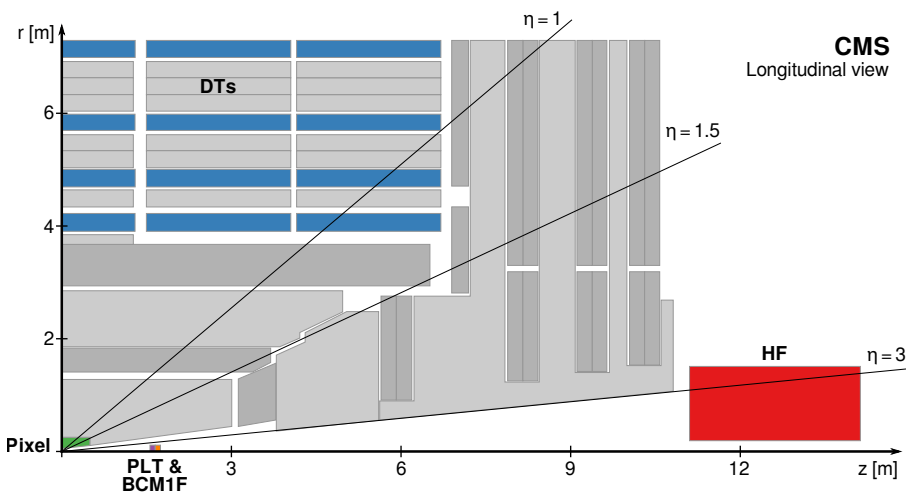

# Luminosity

!!! Warning
    This page is under construction

In collider physics, discovery potential can be summarized with two pieces of information:

 - center-of-mass collision energy, $\sqrt{s}$, that drives the range of produced particle masses, and
 - luminosity, $\mathcal{L}$, that drives the size of the accumulated dataset.

## Calculating luminosity

### Practicalities

CMS uses a tool called `brilcalc` to compute luminosity. This tool is documented in the [CMS Guide on how to calculate luminosity](https://opendata.cern.ch/docs/cms-guide-luminosity-calculation), which contains software installation instructions and many example calculations.

### Theory

Luminosity can be measured for small moments in time (*instantaneous luminosity*) or integrated over a full data-taking period (*integrated luminosity*). CMS and the LHC use instantaneous luminosity information to understand the collision environment during data-taking. The integrated luminosity value is used by all analysts to measure cross sections of a process being studied, or to determine the number of events expected for physics processes with well-known cross sections. Luminosity is the ratio of the production rate, $R$, (or number of produced events, $N$) and the "cross section" for the considered process:

$\mathcal{L}(t) = R(t)/\sigma,$

$\mathcal{L}_{\mathrm{int.}} = N/\sigma.$

Cross section is measured in "barns", a unit of area relevant for nuclear-scale processes. The most literal meaning of the word cross section would describe cutting a (spherical?) atomic nucleus in half through the middle, exposing a circular flat surface. As targets for projectiles in nuclear reactions, most atomic nuclei "look" fairly circular, and the circles would have areas on the order of 10-100 square femtometers. A "barn" is exactly 100 square femtometers, or $1 \times 10^{-28}$ square meters. Luminosity is therefore measured in the even stranger unit of inverse barns!

Typical cross sections for particle physics interactions are much smaller than nuclear physics interactions, ranging from millibarns down to femtobarns. The integrated luminosities required to discover these interactions grows as the cross section shrinks.

#### CMS Luminometers

CMS has several subdetectors that serve as "luminometers":

 - Pixels: pixel tracking detector, which covers $|\eta| < 2.5$
 - HF: forward hadron calorimeter, which covers $3 < |\eta| < 5.2$
 - PLT: pixel luminosity telescope, an array of 16 "telescopes" with pixel sensors in planes facing the interaction point.
 - BCM1F: the fast beam conditions monitor, a system of diamond sensors on the PLT apparatus.

The pixel detector contributes two measurements that are used for luminosity calculations: the number of charge clusters observed, and the number of vertices found with more than 10 tracks. The number of clusters can be used to compute the cross section for producing "visible particles". It is vanishingly unlikely that particles overlap each other in the pixel detector, so the average number of clusters in the pixel detector tracks directly with the number of simultaneous collisions in CMS. The visible cross section is the slope, or ratio, of this relationship.

In the HF, a suite of FPGA readout electronics processes data at the full 40 MHz LHC collision rate. The record the number of channels in which above-threshold charge was deposited during the bunch crossing. The PLT looks for tracks from the collision point that hit all three sensors in one of the telescopes -- the fraction of events with no PLT coincidences can be used in the luminosity calculation. The BCM1F has readout that is optimized for time precision. This subdetector has a time resolution of just over 6 ns, so it can separate collision hits from beam-related background hits. The data from all of these luminometers can be used to converge on a precise, stable determination of the luminosity in CMS.

#### Luminosity calculation and calibration

The true mean number of interations per LHC bunch crossing, $\mu$, is proportional to the instantaneous luminosity of the bunch crossing:

$\mu = \sigma \mathcal{L}_b / v_r$,

where $v_r = 11 245.6$ Hz is the revolution frequency of the LHC, and $\sigma$ is the total interaction cross section.

In the pixel detector, $\mathcal{L}_b$ can be estimated from this formula by considering the average number of clusters and the visible cross section obtained by comparing the number of clusters to number of interactions. This algorithm is known as "rate scaling":

$\mathcal{L}_b = N_{\mathrm{av}} v_r / \sigma_{\mathrm{vis}}.$

For the HF, PLT, and BCM1F luminometers, the "zero counting" method gives a better luminosity estimate, since these detectors are more likely than the pixel detectors to have multiple signals overlap and be counted as one observation. The number of interactions per bunch crossing is governed by the Poisson distribution, so if there is a probability $p$ for an interaction result in 0 observations in a luminometer and $k$ interactions in a given bunch crossing, the expected fraction of "empty" events, $\langle f_0 \rangle$, can be written as the sum of the Poisson distribution times the total probability for all possible values of $k$:

$\langle f_0 \rangle = \sum_{k = 0}^{\infty}{\frac{e^{-\mu} \mu^k}{k!} p^k} = e^{-\mu(1-p)}$.

The true mean number of interactions per bunch cross can be extracted from this formula and related to the instantaneous luminosity per bunch crossing:

$\mathcal{L}_b = \frac{-\ln\langle f_0 \rangle}{1-p} \frac{v_r}{\sigma}.$

We can measure the *visible* cross section, $\sigma_{\mathrm{vis}}$, from the pixel detector, which is effectively $(1-p)\sigma$, since $1-p$ is the probability for an interaction to produce hits in a luminometer. The luminosity from the zero-counting method is then:

$\mathcal{L}_b = -\ln\langle f_0 \rangle v_r/\sigma_{\mathrm{vis}}$.

The two methods produce very similar formulas based on different observables. After computing the per-bunch-crossing luminosity with these methods, a wide array of calibration methods are employed to ensure the precision and accuracy of the result. Beam-separation scans, information from independent detectors such as the muon drift tubes, beam position and current monitoring data, and more are used to compute corrections and uncertainties in the luminosity measurement.

## CMS Luminosity values

Proton-proton collisions:

 - 2011 data: 5.1 fb$^{-1}$
 - 2012 data: 19.6 fb$^{-1}$
 - 2015 data: 2.3 fb$^{-1}$
 - 2016 data: 35.9 fb$^{-1}$ (As of 2024, 16.4 fb$^{-1}$ have been released as Open Data.)

Heavy-ion collisions:

 - 2011 PbPb data: 149 $\mu\mathrm{b}^{-1}$
 - 2013 pp reference data: 5.3 pb$^{-1}$
 - 2013 pPb data: 30.4 nb$^{-1}$
 - 2015 pp reference data: 28 pb$^{-1}$
 - 2015 PbPb data: 560 $\mu\mathrm{b}^{-1}$

Read more:

 - [Luminosity Public Results](https://twiki.cern.ch/twiki/bin/view/CMSPublic/LumiPublicResults)
 - [Data Quality Public Results](https://twiki.cern.ch/twiki/bin/view/CMSPublic/DataQuality)
 - [Luminosity publications](https://twiki.cern.ch/twiki/bin/view/CMSPublic/PhysicsResultsLUM)
 