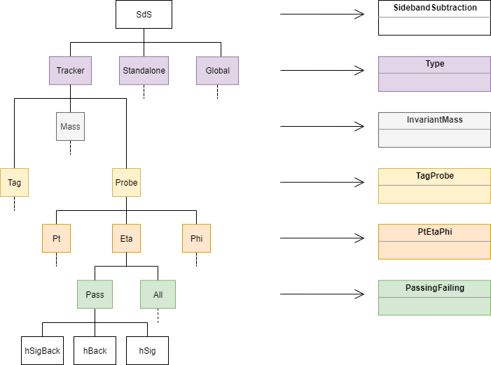
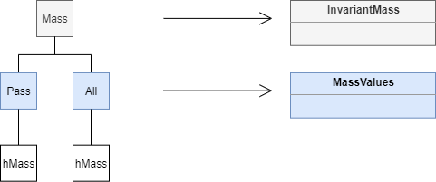

# Efficiency Tool

For CMS efficiency using tag and probe, we developed two codes separatelly for each method presented in this wiki before. You can find those tools here:

* [For sideband subtraction](https://github.com/allanjales/tag-probe)
* [For fitting method](https://github.com/AthomsG/LIP_INTERNSHIP/)

!!! Warning
	This wiki will guide you through **Sideband subtraction** method for Tag & Probe efficiencies.

	If you are looking for fitting method, there are two links:

	* [Read-me (fitting method)](https://github.com/AthomsG/LIP_INTERNSHIP/blob/master/README.md)
	* [Functions (fitting method)](https://github.com/AthomsG/LIP_INTERNSHIP/blob/master/Documentation.md)

## Workshop

Here is a [workshop](https://cms-opendata-workshop.github.io/workshop-lesson-tagandprobe/) given about the code. Some parts of code changed, but it can guide you through this code.

## Code structure

The diagram below represents the structure of objects in code. At left we have the structure of objects name. At right we have the correspondent class name of objects in these line.

Also in Mass object we have:

Notice that all objects in same line shares the same structure.

## Example of using it (macro.cpp)

## Classes list

There are some classes in Sideband Subtraction Tag And Probe project and they are distributed in these files with same name:

Static functions:

* [FitFunctions](referenceguide/FitFunctions.md)
	* [Primary](referenceguide/FitFunctions.md#primary)
	* [Merged](referenceguide/FitFunctions.md#merged)
		* Jpsi
		* Upsilon

Classes and struct:

* [SidebandSubtraction](referenceguide/SidebandSubtraction.md)
	* [Type](referenceguide/Type.md)
		* [InvariantMass](referenceguide/InvariantMass.md)
			* [MassValues](referenceguide/MassValues.md)
		* [TagProbe](referenceguide/TagProbe.md)
			* [PtEtaPhi](referenceguide/PtEtaPhi.md)
				* [PassingFailing](referenceguide/PassingFailing.md)

This format shows what nested classes. Classes or structs below slided at right represents they are encountered inside the class above it.

## Reference guide

A example of how implement this code can be found in [macro](referenceguide/macro.md) page. There, in **Reference Guide**, you can found some reference to the tool developed for efficiency calculation using sideband subtraction method.

!!! Note
	In the guide we use *function(...)* in title when a function has arguments. Function with no arguments are written *function()* with no "...".