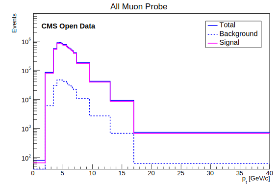

# Signal Extraction

Detector reconstruction efficiencies are calculated using signal muons, that is, only true candidates decaying to dimuons. This is achieved in this study by extracting signal from  the data by the usage of some methods. Here it is presented two: sideband subtraction and fitting.

## Sideband subtraction method

The sideband subtraction method involves choosing sideband and signal regions in invariant mass distribution for each tag+probe pair. The signal region is selected by finding the ressonance position and defining a region around it. While the signal region contains both signal and background, the sideband region is chosen such as to have only background, with a distance from signal region. A example of those regions selection can be seen below for the J/psi ressonance.

For each event category (i.e. Pass and All), and for a given variable of interest (e.g., the probe pT), two distributions are obtained, one for each region (Signal and Sideband). In order to obtain the variable distribution for the signal only, we proceed by subtracting the Background distribution (Sideband region) from the Signal+Background one (Signal region):

Where the normalization α factor quantifies the quantity of background present in the signal region:

And for the uncertainty:

Applying those equations we get histograms like this:

* Solid blue line (Total) = particles in signal region;
* Dashed blue line (Background) = particles in sideband regions;
* Solid magenta line (signal) = signal histogram subtracted.

## Fitting method

In this method, the signal is extracted not by histogram manipulation but by likelihood fitting. The procedure is applied after splitting the data in sub-samples, corresponding to bins of the kinematic variable of interest of the probe objects. As such, the efficiency will be measured as a function of that variable. Each sub-sample contains signal and background events; the signal is accessed by fitting the invariant mass spectra

The fit for each bin allows to statistically discriminate between signal and background. In particular, the fit yields the number of signal events. The efficiency is finally obtained by simply forming the ratio of the signal yield from the fit to the *passing* category by the signal yield from the fit of the inclusive *all* category. This approach is illustrated below.

