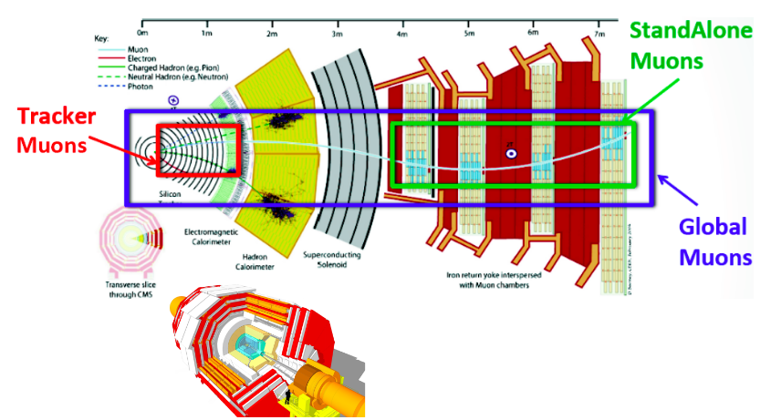

# Introduction

## What is the tag and probe method?

The **tag and probe** method is a **data-driven technique** for measuring particle detection efficiencies. It is based on the decays of known resonances (e.g. J/ψ, ϒ and Z) to pairs of the particles being studied. In this exercise, these particles are muons, and the J/ψ resonance is nominally used.

The determination of the detector efficiency is a critical ingredient in any physics measurement. It accounts for the particles that were produced in the collision but escaped detection (did not reach the detector elements, were missed by the reconstructions algorithms, etc). It can be in general estimated using simulations, but simulations need to be calibrated with data. The T&P method here described provides a useful and elegant mechanism for extracting efficiencies **directly from data!**.

## What is "tag" and "probe"?

The resonance, used to calculate the efficiencies, decays to a pair of particles: the tag and the probe.

* Tag muon = well identified, triggered muon (tight selection criteria).
* Probe muon = unbiased set of muon candidates (very loose selection criteria), either passing or failing the criteria for which the efficiency is to be measured.

## How do we calculate the efficiency?

The efficiency is given by the fraction of probe muons that pass a given criteria (in this case, the **Muon ID** which we explain [below](#cms-muon-identification-reconstruction)):

AAAA

The denominator corresponds to the number of resonance candidates (tag+probe pairs) reconstructed in the dataset. The numerator corresponds to the subset for which the probe passes the criteria.

The tag+probe invariant mass distribution is used to select only signal, that is, only true J/ψ candidates decaying to dimuons. This is achieved in this exercise by the usage of two methods: **fitting** and **side-band-subtraction**.

## CMS Muon identification and reconstruction

The final objective in this lesson is to measure the efficiency for identifying reconstructed **tracker muons**.  We present here a short description of the muon identification and reconstruction employed in the CMS experiment at the LHC.

In the standard CMS reconstruction for proton-proton collisions, tracks are first reconstructed independently in the inner tracker and in the muon system. Based on these objects, two reconstruction approaches are used:

* Tracker Muon reconstruction (red line): In this approach, all tracker tracks with pT > 0.5 GeV/c and total momentum p > 2.5 GeV/c are considered as possible muon candidates and are extrapolated to the muon system taking into account the magnetic field;

* Standalone Muon reconstruction (green line): they are all tracks of the segments reconstructed in the muon chambers (performed using segments and hits from Drift Tubes - DTs in the barrel region, Cathode strip chambers - CSCs in the endcaps and Resistive Plates Chambers - RPCs for all muon system) are used to generate "seeds" consisting of position and direction vectors and an estimate of the muon transverse momentum;

* Global Muon reconstruction (blue line): For each standalone-muon track, a matching tracker track is found by comparing parameters of the two tracks propagated onto a common surface.

You can find more details concerning CMS Muon Identification and reconstruction in this paper [JINST 7 (2012) P10002](https://doi.org/10.1088/1748-0221/7/10/P10002).
