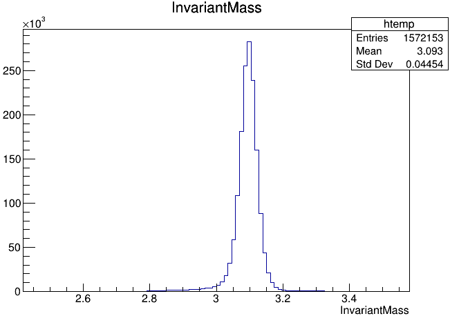
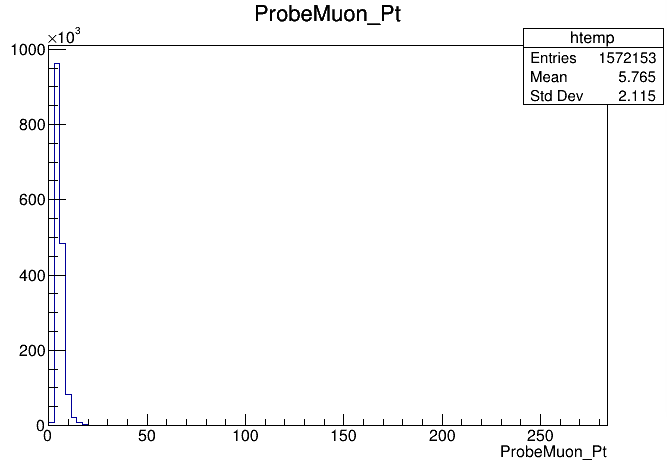

# Fitting

## Setting it up

In order to run this exercise you do not really need to be in a CMSSW area.  It would be actually better if you worked outside your usual CMSSW_5_3_32 environment.  So, if, for instance, you are working with the Docker container, instead of working on `/home/cmsusr/CMSSW_5_3_32/src` you could work on any directory you can create at the `/home/cmsusr` level. Alternatively, you could work directly on your own host machine if you managed to install ROOT on it.

For this example we assume you will be working in either the Docker container or the virtual machine.

Since we will be needing ROOT version greater than 6 and this code has been tested in root version 6.22/00, do not forget to set it up from LCG (as you learned in the ROOT pre-exercise) by doing:

```sh
source /cvmfs/sft.cern.ch/lcg/views/LCG_98/x86_64-slc6-gcc8-opt/setup.sh
```

Clone the repository and go to the fitting method tutorial:

```sh
git clone git://github.com/allanjales/TagAndProbe
cd TagAndProbe/efficiency_tools/fitting
```

You will also need to download the simplified TagAndProbe_Jpsi_Run2011.root data set using [this link](https://cernbox.cern.ch/index.php/s/lqHEasYWJpOZsfq) and put it on the `DATA` folder.

If you are trying to use other ntuple and it does not have the simplied version of that, it should be simplied with `simplify_data.cpp` in order to run the fitting method over it. Details about this process can be found in [Overview page of reference guide for fitting method](../../fittingreferenceguide/overview#simplify_datacpp).

## The Fitting Method

First, a brief explanation of the method we’ll be studying.

It consists on fitting the invariant mass of the tag & probe pairs, in the two categories: passing probes, and all probes.  I.e., for the unbiased leg of the decay, one can apply a selection criteria (a set of cuts) and determine whether the object passes those criteria or not.

The procedure is applied after splitting the data in bins of a kinematic variable of the probe object (e.g. the traverse momentum, pT); as such, the efficiency will be measured as a function of that quantity for each of the bins.

So, in the picture below, on the left, let's imagine that the pT bin we are selecting is the one marked in red.  But, of course, in that bin (like in the rest) you will have true J/ψ; decays as well as muon pairs from other processes (maybe QCD, for instance).  The true decays would make up our *signal*, whereas the other events will be considered the *background*.

The fit, which is made in a different space (the invariant mass space) allows to statistically discriminate between signal and background. To compute the efficiency we simply divide the signal yield from the fits to the `passing` category by the signal yield from the fit of the `inclusive` (All) category. This approach is depicted in the middle and right-hand plots of the image below.

At the end of the day, then, you will have to make these fits for each bin in the range of interest.


Let's start exploring our dataset. From the cloned directory, type:

```sh
cd DATA
root -l TagAndProbe_Jpsi_MC.root
```

If everything's right, you should get something like:

```plaintext
Attaching file TagAndProbe_Jpsi_MC.root as _file0...
(TFile *) 0x563c69a68d90
```

Of course, you can explore this file, if you want, using all the tools you learn in the ROOT pre-exercise.  This file contains ntuples that were obtained using procedures similar to the ones you have been learning in this workshop.

!!! Note
    In the following plots, remember that the units of the x axis are in GeV/c.

Now, before we start fitting the invariant mass it's important to look at it's shape first. To visualize our data's invariant mass, do (within ROOT):

```cpp
tagandprobe->Draw("InvariantMass")
```



If you got the previous result, we're ready to go.

The dataset used in this exercise has been collected by the CMS experiment, in proton-proton collisions at the LHC. It contains 1572153 entries (muon pair candidates) with an associated invariant mass. For each candidate, the transverse momentum (pT), rapidity(&eta;) and azimuthal angle (&phi;) are stored, along with a binary flag `PassingProbeTrackingMuon`, which is 1 in case the corresponding probe satisfied the tracker muon selection criteria and 0 in case it doesn't.

!!! Note
    Note that it does not really matter what kind of selection criteria these ntuples were created with.  The procedure would be the same.  You can create your own, similar ntuples with the criteria that you need to study.

As you may have seen, after exploring the content of the root file, the tagandprobe tree has these variables:

| InvarianMass |
| ProbeMuon_Pt |
| ProbeMuon_Eta |
| ProbeMuon_Phi|
| PassingProbeTrackingMuon |
| PassingProbeStandAloneMuon |
| PassingProbeGlobalMuon |

We'll start by calculating the efficiency as a function of pT.  It is useful to have an idea of the distribution of the quantity we want to study. In order to do this, we’ll repeat the steps previously used to plot the invariant mass, but now for the `ProbeMuon_Pt` variable.

```cpp
tagandprobe->Draw("ProbeMuon_Pt")
```



Hmm.. seems like our domain is larger than we need it to be. To fix this, we can apply a constraint to our plot. Try:

```cpp
tagandprobe->Draw("ProbeMuon_Pt", "ProbeMuon_Pt < 20")
```


Exit ROOT and get back to the main area:

```bash
.q
cd ..
```

Now that you're acquainted with the data, open the  `efficiency.cpp` file.
You'll have to make some small adjustments to the code in this section:

We'll start by choosing the desired bins for the transverse momentum, so the only quantity that shouldnt be commented is the first Pt as shown bellow.

```cpp
//Which quantity do you want to use?
string quantity = "Pt";     double bins[] = {0., 2.0, 3.4, 4.0, 4.4, 4.7, 5.0, 5.6, 5.8, 6.0, 6.2, 6.4, 6.6, 6.8, 7.3, 9.5, 13.0, 17.0, 40.};
//string quantity = "Eta";    double bins[] = {-2.4, -1.8, -1.4, -1.2, -1.0, -0.8, -0.5, -0.2, 0, 0.2, 0.5, 0.8, 1.0, 1.2, 1.4, 1.8, 2.4};
//string quantity = "Phi";    double bins[] = {-3.0, -1.8, -1.6, -1.2, -1.0, -0.7, -0.4, -0.2, 0, 0.2, 0.4, 0.7, 1.0, 1.2, 1.6, 1.8, 3.0};
```

## The Fit

We execute a simultaneous fit using a Gaussian curve and a Crystall Ball function. For the background we use a Exponential. The function used, `doFit_Jpsi_Run_h()`, is implemented in the source file `src/dofits/doFit_Jpsi_Run.h`.

The fitting and storing of the fit output of each bin is achieved by the following loop in the `efficiency.cpp` code.

```cpp
int nbins = sizeof(bins)/sizeof(*bins) - 1;
    double** yields_n_errs = new double*[nbins];
    for (int i = 0; i < nbins; i++)
    {
        //Creates conditions
        string conditions = string(    "ProbeMuon_" + quantity + ">=" + to_string(bins[i]  ));
        conditions +=       string(" && ProbeMuon_" + quantity + "< " + to_string(bins[i+1]));

        //Stores [yield_all, yield_pass, err_all, err_pass]
        yields_n_errs[i] = doFit(conditions, MuonId, path_bins_fit_folder);
    }
```

To get the efficiency plot, we used the [TEfficiency](https://root.cern.ch/doc/master/classTEfficiency.html) class from ROOT.
You'll see that in order to create a ``TEfficiency`` object, one of the [constructors](https://root.cern.ch/doc/master/classTEfficiency.html#aa0e99b4161745fd3bee0ae5c0f58880e) requires two `TH1` objects, i.e., two histograms. One with _all_ the probes and one with the _passing_ probes.

The creation of these `TH1` objects is taken care of by the ``src/make_TH1D.h`` code.

??? Example "Check out `src/make_TH1D.h`"

    ```cpp
    TH1D* make_TH1D(string name, double** values, int index, double* bins, int  nbins, string quantity = "", bool draw = false)
    {
    //AddBinContent
    //HISTOGRAM NEEDS TO HAVE VARIABLE BINS

    TH1D* hist = new TH1D(name.c_str(), name.c_str(), nbins, bins);

    hist->GetYaxis()->SetTitle("Events");
    if      (quantity == "Pt" ) hist->GetXaxis()->SetTitle("p_{T}   [GeV/c]");
    else if (quantity == "Eta") hist->GetXaxis()->SetTitle("#eta");
    else if (quantity == "Phi") hist->GetXaxis()->SetTitle("rad");

    for (int i = 0; i < nbins; i++)
    {
        hist->SetBinContent(i+1, values[i][index]);
        hist->SetBinError(i+1, values[i][index+2]);
        //cout << i << " -> (" << hist->GetBinLowEdge(i+1) << "," <<    hist->GetBinLowEdge(i+1)+hist->GetBinWidth(i+1) << ") == " <<       hist->GetBinContent(i+1) << "\n";
    }

    if (draw)
    {
        TCanvas* xperiment = new TCanvas;
        xperiment->cd();
        hist->Draw();
    }

    return hist;
    }
    }
    ```

To plot the efficiency we used the ``src/get_efficiency.h`` function.

??? Example "Check out `get_efficiency.h`"

    ```cpp
    TEfficiency* get_efficiency(TH1D* all, TH1D* pass, string quantity,         string MuonId, string prefix_name = "", bool shouldWrite = false)
    {
    //Copy histograms to change axis titles later
    TH1D* pass_copy = (TH1D*)pass->Clone();
    TH1D* all_copy  = (TH1D*)all ->Clone();

    pass_copy->GetYaxis()->SetTitle("Efficiency");
    all_copy ->GetYaxis()->SetTitle("Efficiency");

    TEfficiency* pEff = new TEfficiency();
    pEff->SetPassedHistogram(*pass_copy, "f");
    pEff->SetTotalHistogram (*all_copy,  "f");

    delete all_copy;
    delete pass_copy;

    //Set plot config
    if (prefix_name != "")
    {
        pEff->SetName(string(MuonId + "_" + quantity + "_" +        prefix_name + "_Efficiency").c_str());
        pEff->SetTitle(string("Efficiency for " + MuonId + " " +        quantity + " (" + prefix_name + ")").c_str());
    }
    else
    {
        pEff->SetName(string(MuonId + "_" + quantity +  "_Efficiency").c_str());
        pEff->SetTitle(string("Efficiency for " + MuonId + " " +        quantity).c_str());
    }

    pEff->SetLineColor(kBlack);
    pEff->SetMarkerStyle(21);
    pEff->SetMarkerSize(0.5);
    pEff->SetMarkerColor(kBlack);

    if (shouldWrite)
        pEff->Write();

    TCanvas* oi = new TCanvas();
    oi->cd();
    pEff->Draw();

    gPad->Update();
    auto graph = pEff->GetPaintedGraph();
    graph->SetMinimum(0.8);
    graph->SetMaximum(1.2);
    gPad->Update();

    return pEff;
    }
    ```

Note that we load all these functions in the `src` area directly in header of the `efficiency.cpp` code.

Before we run the code you have first to uncomment this line in the `efficiency.cpp` code so it looks like this.

```cpp
    //Create efficiencies
    generatedFile->   cd("/");
    get_efficiency(yield_all, yield_pass, quantity, MuonId, "", true);
```

Now that you understand what the ``efficiency.cpp`` macro does, run your code without flashing the scream('-l'), with a batch mode (`-b`) and with a quit-when-done switch (`-q`):

```sh
root -l -b -q efficiency.cpp
```

If everything went correctly you should have a 'Pt_globalMuon.root' in the path below.

```sh
cd results/efficiencies/efficiency/Jpsi_Run_2011/
```

We will need to run the code again with a few changes so go back to the main file.

```sh
cd ../../../..
```

Now we need to create the Monte Carlo(MC) data to compare with the real one, in order to do that we will need to change the ´efficiency.cpp´ code, you will have to include the ´#include "src/dofits/DoFit_Jpsi_MC.h"´ and comment the ´#include "src/dofits/DoFit_Jpsi_Run.h"´ part, your code should look like this:

```cpp
//Change if you need
//#include "src/dofits/DoFit_Jpsi_Run.h"
#include "src/dofits/DoFit_Jpsi_MC.h"
#include "src/create_folder.h"
#include "src/get_efficiency.h"
#include "src/make_TH1D.h"

//Which Muon Id do you want to study?
//string MuonId   = "trackerMuon";
//string MuonId   = "standaloneMuon";
string MuonId   = "globalMuon";

//Which quantity do you want to use?
string quantity = "Pt";     double bins[] = {0., 2.0, 3.4, 4.0, 4.4, 4.7, 5.0, 5.6, 5.8, 6.0, 6.2, 6.4, 6.6, 6.8, 7.3, 9.5, 13.0, 17.0, 40.};
//string quantity = "Eta";    double bins[] = {-2.4, -1.8, -1.4, -1.2, -1.0, -0.8, -0.5, -0.2, 0, 0.2, 0.5, 0.8, 1.0, 1.2, 1.4, 1.8, 2.4};
//string quantity = "Phi";    double bins[] = {-3.0, -1.8, -1.6, -1.2, -1.0, -0.7, -0.4, -0.2, 0, 0.2, 0.4, 0.7, 1.0, 1.2, 1.6, 1.8, 3.0};
//string quantity = "Pt";     double bins[] = {0., 40.};

```

Run the efficiency.cpp again and you will have 2 new folders at results/efficiencies/efficiency one "Jpsi_MC_2020" and other "Jpsi_Run_2011".If you want to see each individual efficiency you can use the TBrowser to open the globalMuon_Pt_efficiency file.

Now, in order to make the comparison between real and MC data we will need to change the efficiency.cpp once more, to do this you must include #include the "compare_efficiency.cpp" and put the code below in the efficiency.cpp file.

```sh
compare_efficiency(quantity, "results/efficiencies/efficiency/Jpsi_Run_2011/Pt_globalMuon.root", "results/efficiencies/efficiency/Jpsi_MC_2020/Pt_globalMuon.root");
```

So your code should look like this.

```cpp
//Change if you need
//#include "src/dofits/DoFit_Jpsi_Run.h"
#include "src/dofits/DoFit_Jpsi_MC.h"
#include "src/create_folder.h"
#include "src/get_efficiency.h"
#include "src/make_TH1D.h"
#include "tests/compare_efficiency.cpp"

//Which Muon Id do you want to study?
//string MuonId   = "trackerMuon";
//string MuonId   = "standaloneMuon";
string MuonId   = "globalMuon";

//Which quantity do you want to use?
string quantity = "Pt";     double bins[] = {0., 2.0, 3.4, 4.0, 4.4, 4.7, 5.0, 5.6, 5.8, 6.0, 6.2, 6.4, 6.6, 6.8, 7.3, 9.5, 13.0, 17.0, 40.};
//string quantity = "Eta";    double bins[] = {-2.4, -1.8, -1.4, -1.2, -1.0, -0.8, -0.5, -0.2, 0, 0.2, 0.5, 0.8, 1.0, 1.2, 1.4, 1.8, 2.4};
//string quantity = "Phi";    double bins[] = {-3.0, -1.8, -1.6, -1.2, -1.0, -0.7, -0.4, -0.2, 0, 0.2, 0.4, 0.7, 1.0, 1.2, 1.6, 1.8, 3.0};
//string quantity = "Pt";     double bins[] = {0., 40.};

void efficiency()
{

    compare_efficiency(quantity, "results/efficiencies/efficiency/Jpsi_Run_2011/Pt_globalMuon.root", "results/efficiencies/efficiency/Jpsi_MC_2020/Pt_globalMuon.root");

    //Path where is going to save results png for every bin
    const char* path_bins_fit_folder = "results/bins_fit/efficiency/";
    create_folder(path_bins_fit_folder, true);
```

If you want you can comment everything below the compare_efficiency(be cafefull not to comment the last "}")

Now you should have a new folder called "Comparison Run2011 vs MC" in it is the comparison that you just made.


If everything went well and you still have time to go, repeat this process for the two other variables, &eta; and &phi;!
