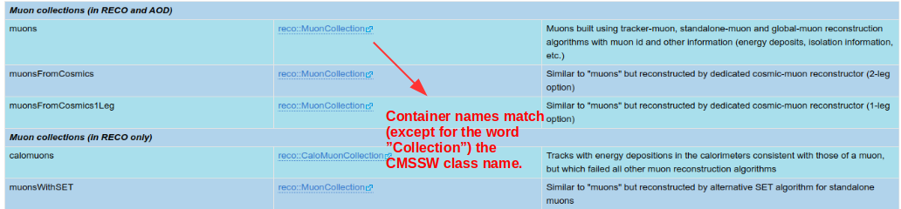
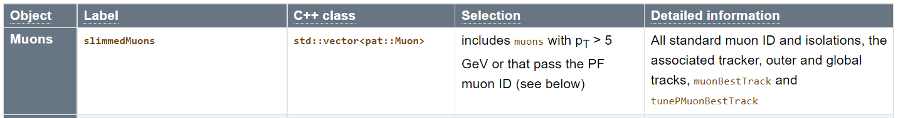
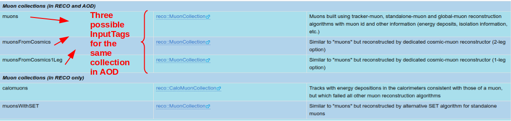

# Physics Objects

!!! Warning
    This page is under construction

## Description

The CMS is a giant detector that acts like a camera that "photographs" particle collisions, allowing us to interpret their nature.

Certainly we cannot directly observe all the particles created in the collisions because some of them decay very quickly or simply do not interact with our detector.  However, we can infer their presence.  If they decay to other stable particles and interact with the apparatus, they leave signals in the CMS subdetectors. These signals are used to *reconstruct* the decay products or infer their presence; we call these **physics objects**.  These objects could be electrons, muons, jets, missing energy, etc., but also lower level objects like tracks.  For the current releases of open data, we store them in ROOT files following the EDM data model in AOD format.

In the [CERN Open Portal](../../../tools/cernportal/) site one can find a description of these physical objects and a list of them corresponding to [2010](http://opendata.cern.ch/docs/cms-physics-objects-2010) and [2011/2012](http://opendata.cern.ch/docs/cms-physics-objects-2011) releases of open data. For Run 2 data from 2015, a detailed [listing](https://twiki.cern.ch/twiki/bin/view/CMSPublic/WorkBookMiniAOD2015#High_level_physics_objects) is available in the CMS WorkBook.

## DataFormats

=== "Run 1 Data"

    As one can see in those guides, these physical objects are usually stored in specific *collections*.  For instance, [muons](http://opendata.cern.ch/docs/cms-physics-objects-2011#muons) are most commonly obtained from the `reco::Muon` collection.  The [AOD Data Format Table](https://twiki.cern.ch/twiki/bin/view/CMSPublic/SWGuideAodDataTable) gives a good description of the different collections (or data formats) for the AOD tier.  Unfortunately, the links for the *containers* column got broken after CMSSW was moved to Github.  Those links would have pointed us to the corresponding CMSSW C++ classes associated with those containers.  This is important because one needs to know which CMSSW class matches a given collection of objects to include the headers of those classes in the header of your analyzer code.  But let that not let us down.

    

    Fortunately, the names of the collections *containers* actually match the name of its associated CMSSW classes.  These classes (data format classes) live under the [DataFormats](https://github.com/cms-sw/cmssw/tree/master/DataFormats) directory in CMSSW.  If we browse through, we find the `MuonReco` package.   In its `interface` area we find the [DataFormats/MuonReco/interface/Muon.h](https://github.com/cms-sw/cmssw/blob/master/DataFormats/MuonReco/interface/Muon.h) class header, which is the one we would need to incorporate in our analyzer.  This is corroborated by this [Muon Analysis Twiki section](https://twiki.cern.ch/twiki/bin/view/CMSPublic/WorkBookMuonAnalysis#Available_information).

    !!! Note "Remember"
        When accessing a specific piece of code in the CMSSW github repository, and want to explore its methods, variables, etc., make sure you select the right git branch.  E.g., [CMSSW_5_3_X](https://github.com/cms-sw/cmssw/blob/CMSSW_5_3_X/DataFormats/MuonReco/interface/Muon.h) for 2011/2012 open data.

    In addition to this base class, sometimes it is necessary to invoke other auxiliary classes.  For instance, [DataFormats/MuonReco/interface/MuonFwd.h](https://github.com/cms-sw/cmssw/blob/master/DataFormats/MuonReco/interface/MuonFwd.h), which can be found in the same interface area.

    So, in the context of this example, in order to support muons information, at the top of your [EDAnalyzer](../../../cmssw/cmsswanalyzers/) you should include the following lines:

    ~~~ c++
    //classes to extract Muon information
    #include "DataFormats/MuonReco/interface/Muon.h"
    #include "DataFormats/MuonReco/interface/MuonFwd.h"
    ~~~

=== "Run 2 Data"

    As one can see in those guides, these physical objects are usually stored in specific *collections*.  For instance,  muons are obtained from the C++ class `std::vector<pat::Muon>` (most often called `pat::MuonCollection` using its definition in [the muon class](https://cmsdoxygen.web.cern.ch/cmsdoxygen/CMSSW_7_6_7/doc/html/dc/d3b/DataFormats_2PatCandidates_2interface_2Muon_8h_source.html)). The [MINIAOD physics objects table](https://twiki.cern.ch/twiki/bin/view/CMSPublic/WorkBookMiniAOD2015#High_level_physics_objects) gives a good description of the different collections (or data formats) for the MINIAOD tier. This is the muon entry in that table:

    

    The MINIAOD data format classes live under the [DataFormats/PatCandidates/interface](https://github.com/cms-sw/cmssw/tree/CMSSW_7_6_X/DataFormats/PatCandidates/interface) directory in CMSSW.  Here we find the [DataFormats/PatCandidates/interface/Muon.h](https://github.com/cms-sw/cmssw/blob/CMSSW_7_6_X/PatCandidates/interface/Muon.h) class header, which is the one we would need to incorporate in our analyzer.

    So, in the context of this example, in order to support muons information, at the top of your [EDAnalyzer](../../../cmssw/cmsswanalyzers/) you should include the following line:

    ~~~ c++
    //classes to extract Muon information
    #include "DataFormats/MuonReco/interface/Muon.h"
    ~~~

## Access methods

In the [Event methods for data access](https://twiki.cern.ch/twiki/bin/view/CMSPublic/SWGuideEDMGetDataFromEvent#Event_methods_for_data_access) section of the *Getting Data From an Event* Twiki page, one can find a complete description of the different methods available for *Event* data access.

!!! Note "Remember"
    When accessing the CMS twiki pages we will usually point you to the most recent page.  However, historical Twiki documentation, i.e., earlier revision of the pages, may provide more accurate information for open data that is already a few years old. One can access this historical archive by going to the bottom of any Twiki page, clicking on **History** and exploring the revisions closer to the open data release year.

=== "Run 1 Data"

    As indicated in that page, all Event data access methods use the `edm::Handle<T>`, where `T` is the C++ type of the requested object, to hold the result of an access.  As an example, during Run 1, the recommended method was the `getByLabel` one.  This method needed an `InputTag`.  This can also be extracted from the [AOD Data Format Table](https://twiki.cern.ch/twiki/bin/view/CMSPublic/SWGuideAodDataTable).  The first column indicate the InputTag:

    

    Therefore, in the context of this muon example, in the `analyze` method of your [EDAnalyzer](../../../cmssw/cmsswanalyzers/) you should include the following lines:

    ~~~ c++
    Handle<reco::MuonCollection> mymuons;
    iEvent.getByLabel("muons", mymuons);
    ~~~

    If you required *cosmic* muons, for some reason, you would need instead:

    ~~~ c++
    Handle<reco::MuonCollection> mymuons;
    iEvent.getByLabel("muonsFromCosmics", mymuons);
    ~~~

    Alternatively, it would be also possible to retrieve the InputTag name from [configuration](../../../cmssw/cmsswconfigure).  In that case, in your configuration file you would need something like:

    ~~~ python
    process.demo = cms.EDAnalyzer('MuonAnalyzer',
                    InputCollection = cms.InputTag("muons")
    )
    ~~~

    In this case, you would need to declare the appropriate input tag in your [EDAnalyzer](../../../cmssw/cmsswanalyzers/) class:

    ~~~ c++
    //declare the input tag for MuonCollection
        edm::InputTag muonInput;
    ~~~

    Extract it from the ParameterSet in the constructor

    ~~~ c++
    MuonAnalyzer::MuonAnalyzer(const edm::ParameterSet& iConfig)
    {
    //now do what ever initialization is needed
    muonInput = iConfig.getParameter<edm::InputTag>("InputCollection");
    }
    ~~~

    and use in the `analyze` routine:

    ~~~ c++
    Handle<reco::MuonCollection> mymuons;
    iEvent.getByLabel(muonInput, mymuons);
    ~~~

=== "Run 2 Data"

    As indicated in that page, all Event data access methods use the `edm::Handle<T>`, where `T` is the C++ type of the requested object, to hold the result of an access.  For Run 2 data, the method is `getByToken`.  This method needs a "token" and an `InputTag`, which will pass the name of the collection to the analyzed. This name is indicated as "Label" [the MINIAOD table](https://twiki.cern.ch/twiki/bin/view/CMSPublic/WorkBookMiniAOD2015#High_level_physics_objects), `slimmedMuons` for muons.

    The InputTag name is defined in the [configuration](../../../cmssw/cmsswconfigure).  Your configuration file would have:

    ~~~ python
    process.mymuons = cms.EDAnalyzer('MuonAnalyzer', 
                    muons = cms.InputTag("slimmedMuons")
    )
    ~~~

    In this case, you would need to declare the appropriate token in your [EDAnalyzer](../../../cmssw/cmsswanalyzers/) class:

    ~~~ c++
    //declare the token for MuonCollection
      edm::EDGetTokenT<pat::MuonCollection> muonToken_;
    ~~~

    which is then passed with the Input Tag to the constructor of the EDAnalyzer class

    ~~~ c++
    MuonAnalyzer::MuonAnalyzer(const edm::ParameterSet& iConfig): 
        muonToken_(consumes<pat::MuonCollection>(iConfig.getParameter<edm::InputTag>("muons")))
    {
    //now do what ever initialization is needed
    ~~~

    and used in the `analyze` routine:

    ~~~ c++
    Handle<pat::MuonCollection> muons;
    iEvent.getByToken(muonToken_, muons);
    ~~~

## Additional information for accessing CMS physics objects

In Chapter 7 of the [CMS Workbook](https://twiki.cern.ch/twiki/bin/view/CMSPublic/WorkBookIntroHiLevelReco) one can find *Analysis* pages that provide additional information, which can be useful to check on top of the general strategy for accessing objects that was discussed above.
