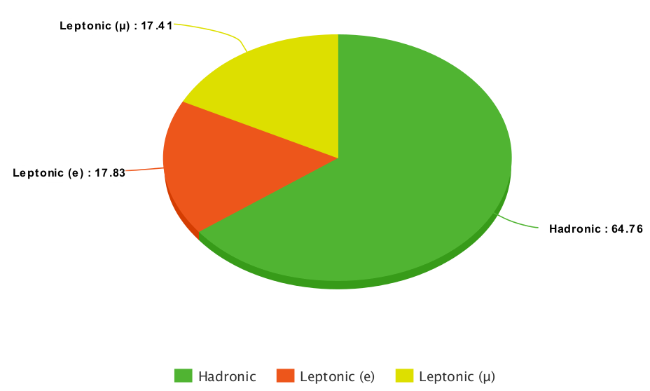

# Taus

## Introduction

Tau lepton having a mass of 1.777 GeV, is the only lepton heavy enough to decay into hadrons. As depicted in the pi-chart, in about one third of the cases τ’s decay leptonically to a muon (τμ) or an electron (τe) with two neutrinos, and are reconstructed and identified with the usual techniques for [muons](./muons.md) and [electrons](./electrons.md). In the remaining cases, τ leptons decay hadronically, to a combination of charged and neutral mesons with a τν.



Hadronically decaying τ’s, denoted by τh, are reconstructed and identified with the hadrons-plus-strips (HPS) algorithm, which was developed for use in the LHC Run-1. The key challenge that this algorithm has to face is the distinction between genuine τh, and quark and gluon jets, which are copiously produced in QCD multijet process and can be misidentified as τh. The main handle for reducing these jet→τh misidentification backgrounds is to utilize the fact that the particles produced in τh decays are of lower multiplicity, deposit energy in a narrow region compared to a quark or gluon jet, and are typically isolated with respect to other particles in the event.

In some physics analyses, the misidentification of electrons or muons as τh candidates may constitute a sizeable background as well. Therefore, HPS algorithm has got various discriminators like isolation, against electrons and muons etc. to identify genuine hadronically decaying taus.

## Tau 4-vector information

=== "Run 1 Data"

    An example of an EDAnalyzer tau information is available in the [TauAnalyzer](https://github.com/cms-opendata-analyses/PhysObjectExtractorTool/blob/2012/PhysObjectExtractor/src/TauAnalyzer.cc) of the Physics Object Extractor Tool (POET). The following header files needed for accessing tau information are included:

    ``` cpp
    //classes to extract tau information
    #include "DataFormats/TauReco/interface/PFTau.h"
    #include "DataFormats/TauReco/interface/PFTauFwd.h"
    #include "DataFormats/TauReco/interface/PFTauDiscriminator.h"
    ```

    In [TauAnalyzer.cc](https://github.com/cms-opendata-analyses/PhysObjectExtractorTool/blob/2012/PhysObjectExtractor/src/TauAnalyzer.cc), the tau four-vector elements are accessed as shown below.

    ``` cpp
    Handle<reco::PFTauCollection> mytaus;
    iEvent.getByLabel(tauInput, mytaus);

    [...]

    for (reco::PFTauCollection::const_iterator itTau=mytaus->begin(); itTau!=mytaus->end(); ++itTau){
        if (itTau->pt() > tau_min_pt) {
            tau_e.push_back(itTau->energy());
            tau_pt.push_back(itTau->pt());
            tau_px.push_back(itTau->px());
            tau_py.push_back(itTau->py());
            tau_pz.push_back(itTau->pz());
            tau_eta.push_back(itTau->eta());
            tau_phi.push_back(itTau->phi());

    [...]
    }
    ```

=== "Run 2 Data"

    An example of an EDAnalyzer tau information is available in the [TauAnalyzer](https://github.com/cms-opendata-analyses/PhysObjectExtractorTool/blob/2015MiniAOD/PhysObjectExtractor/src/TauAnalyzer.cc) of the Physics Object Extractor Tool (POET). The following header file needed for accessing tau information is included:

    ``` cpp
    //class to extract tau information
    #include "DataFormats/PatCandidates/interface/Tau.h"
    ```

    In [TauAnalyzer.cc](https://github.com/cms-opendata-analyses/PhysObjectExtractorTool/blob/2015MiniAOD/PhysObjectExtractor/src/TauAnalyzer.cc), the tau four-vector elements are accessed from the `pat::tau` collection as shown below.

    ``` cpp
    Handle<pat::TauCollection> taus;
    iEvent.getByToken(tauToken_, taus);
    [...]

    for (const pat::Tau &tau : *taus)
    {
        tau_e.push_back(tau.energy());
        tau_pt.push_back(tau.pt());
        tau_px.push_back(tau.px());
        tau_py.push_back(tau.py());
        tau_pz.push_back(tau.pz());
        tau_eta.push_back(tau.eta());
        tau_phi.push_back(tau.phi());
    
    [...]
    }
    ```

    with `tauToken_` defined as a member of the `TauAnalyzer` class and its value read from the [configuration file](https://github.com/cms-opendata-analyses/PhysObjectExtractorTool/blob/2015MiniAOD/PhysObjectExtractor/python/poet_cfg.py).

## Tau identification

=== "Run 1 Data"

    The identification of taus relies almost entirely on pre-computed algorithms to determine the quality of the tau reconstruction and the decay type. Since this object is not stable and has several decay modes, different combinations of identification and isolation algorithms are used across different analyses. The [Tau tagging CMS WorkBook page](https://twiki.cern.ch/twiki/bin/view/CMSPublic/WorkBookPFTauTagging#Legacy_Tau_ID_Run_I) provides a large table of available algorithms.

    In contrast to the muon object, tau algorithm results are typically saved in the AOD files as their own PFTauDisciminator collections, rather than as part of the tau object class. As shown in [TauAnalyzer.cc](https://github.com/cms-opendata-analyses/PhysObjectExtractorTool/blob/2012/PhysObjectExtractor/src/TauAnalyzer.cc), these collections can be accessed with the following impressively long label names:

    ```cpp
    Handle<reco::PFTauDiscriminator> tausLooseIso, tausVLooseIso, tausMediumIso, tausTightIso, 
    tausTightEleRej, tausTightMuonRej, tausDecayMode, tausRawIso;

    iEvent.getByLabel(InputTag("hpsPFTauDiscriminationByDecayModeFinding"),tausDecayMode);
    iEvent.getByLabel(InputTag("hpsPFTauDiscriminationByRawCombinedIsolationDBSumPtCorr"), tausRawIso);
    iEvent.getByLabel(InputTag("hpsPFTauDiscriminationByVLooseCombinedIsolationDBSumPtCorr"), tausVLooseIso);
    iEvent.getByLabel(InputTag("hpsPFTauDiscriminationByLooseCombinedIsolationDBSumPtCorr"), tausLooseIso);
    iEvent.getByLabel(InputTag("hpsPFTauDiscriminationByMediumCombinedIsolationDBSumPtCorr"), tausMediumIso);
    iEvent.getByLabel(InputTag("hpsPFTauDiscriminationByTightCombinedIsolationDBSumPtCorr"), tausTightIso);
    iEvent.getByLabel(InputTag("hpsPFTauDiscriminationByTightElectronRejection"), tausTightEleRej);
    iEvent.getByLabel(InputTag("hpsPFTauDiscriminationByTightMuonRejection"), tausTightMuonRej);
    ```

    The tau discriminator collections act as pairs, containing the index of the tau and the value of the discriminant for that tau. Note that the arrays are filled by calls to the individual discriminant objects, but referencing the vector index of the tau in the main tau collection.

    ``` cpp
    const auto idx = itTau - mytaus->begin();
    tau_iddecaymode.push_back(tausDecayMode->operator[](idx).second);
    tau_idisoraw.push_back(tausRawIso->operator[](idx).second);
    tau_idisovloose.push_back(tausVLooseIso->operator[](idx).second);
    tau_idisoloose.push_back(tausLooseIso->operator[](idx).second);
    tau_idisomedium.push_back(tausMediumIso->operator[](idx).second);
    tau_idisotight.push_back(tausTightIso->operator[](idx).second);
    tau_idantieletight.push_back(tausTightEleRej->operator[](idx).second);
    tau_idantimutight.push_back(tausTightMuonRej->operator[](idx).second);
    ```

    The recommendations for applying these discriminators are summarizes in the [Tau identification nutshell recipe](https://twiki.cern.ch/twiki/bin/view/CMSPublic/NutShellRecipeFor5312AndNewer).

=== "Run 2 Data"

    !!! Note "To do"
        - to complete once POET 2015MiniAOD branch TauAnalyzer has been validated
